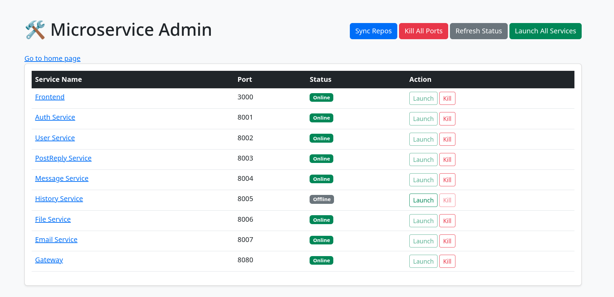

# integration-doc
Follow the following instruction to setup the database first
1. Run `python -m venv venv` to create a virtual environment in current cmd
2. Activate the venv by `source venv/bin/activate`
3. Run `pip install -r requirements.txt` to install package
4. Run `python server.py`. This will launch an admin panel for you
5. Clone all the repos by clicking `sync repos`.
6. Modify the gateway's config file
   Inside `forum-gateway/config/system.config.yml`, there is a field:
   ```
   plugins:
      example: # "express-gateway-plugin-example"
         param1: 'global per plugin param1'
         package: '/home/chenningcong/Desktop/integration-doc/forum-gateway/config/manifest.js'
   ```
   Please replace the `package` path by the *absolute path* on your computer to `forum-gateway/config/policies/example-policy.js`
   This is a bug in express-gateway so we need to circumvent this problem by setting up the path manually.
7. Create a `.env` file in current folder (not in the post&reply folder) (The `MONGO_URI` and `MONGO_PASSWORD` are the same as the one in the post&reply service)
   ```
      ACCESS_TOKEN_SECRET=8efaf6d52fa6d6674e6f9f27d72e0a76285a7be1b93772d7e90f5639c28449c58686f37203f45a629ca4b22d3af7751848ed34cab37297d6f159ee99b835c9de
      MONGO_URI=mongodb+srv://chenningcong393069484_db_user:<PASSWORD>@cluster0.4pa51vd.mongodb.net/?appName=Cluster0
      MONGO_PASSWORD=<replace your password here>
   ```
8. Under `forum-auth-service`, run `cp .env.example .env`
9. Under `forum-user-service`, run `cp .env.example .env`. Then run:
   ```
   sudo mysql -e "DROP USER IF EXISTS 'user_service_user'@'localhost'; CREATE USER 'user_service_user'@'localhost' IDENTIFIED BY 'your_password'; DROP DATABASE IF EXISTS user_service_db; CREATE DATABASE IF NOT EXISTS user_service_db; GRANT ALL PRIVILEGES ON user_service_db.* TO 'user_service_user'@'localhost'; FLUSH PRIVILEGES;"
   ```

   This will reset the database
   If you change the password or user account, you must modify the data in `.env`

   IMPORTANT: if you don't use mysql then you need to change
   ```
   'db': {
                'type': 'atlas',
                'atlas': {
                    'database': '${ MONGO_URI }',
                    'password': '${ MONGO_PASSWORD }'
                }
            }
   ```
   to 
   ```
   'db': { 'type': 'memory'}
   ```
   in deployment.py

10. Under `forum-email-service`, run `cp .env.example .env`. Then you need to replace these fields in the `.env` file:
   ```
   SMTP_USER=<your gmail>
   SMTP_PASSWORD=<16 character password without space>
   SMTP_FROM_NAME=<your app name>
   ```
   To get the password, you need to add an App password in your google account:

   1. Enable 2-Factor Authentication on Google account
   2. Generate App Password: https://myaccount.google.com/apppasswords
   3. Copy the 16-character password (without space!!!)

11. Under `forum-message-service`, run `cp .env.example .env`. Then in `.env`:
   ```
   PORT=8004
   DB_HOST=localhost
   DB_USER=message_service_user
   DB_PASS=your_password
   DB_NAME=message_service_db
   DB_PORT=3306
   ```
   Then run:
   ```
   sudo mysql -e "DROP USER IF EXISTS 'message_service_user'@'localhost'; CREATE USER 'message_service_user'@'localhost' IDENTIFIED BY 'your_password'; DROP DATABASE IF EXISTS message_service_db; CREATE DATABASE IF NOT EXISTS message_service_db; GRANT ALL PRIVILEGES ON message_service_db.* TO 'message_service_user'@'localhost'; FLUSH PRIVILEGES;"
   ```

12. Under `forum-file-service`, copy the `.env` file in slack to the folder:
   It looks like this:
   ```
   # File service runs at http://localhost:8006
   PORT=8006
   TODO_STORAGE_LOCAL_PATH=./uploads
   POST_REPLY_SERVICE_BASE_URL=http://localhost:8003
   USER_SERVICE_BASE_URL=http://localhost:8002
   INTERNAL_SERVICE_HEADER_NAME=X-Internal-Key
   INTERNAL_SERVICE_KEY=dev-internal-key
   AWS_ACCESS_KEY_ID=<>
   AWS_SECRET_ACCESS_KEY=<>
   AWS_REGION=us-west-1
   S3_BUCKET=forum-file-service
   PUBLIC_BASE_URL=https://forum-file-service.s3.us-west-1.amazonaws.com
   MAX_FILE_MB=10
   ```

Launch of service:
Run `python server.py` if you haven't do so. This will launch an admin panel for you:



Then go to `http://localhost:8080/`. Note: it's localhost, not `127.0.0.1`