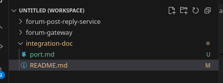

# integration-doc
Follow the following instruction to setup the database first
1. Create a root folder to hold all project source codes (let's say it's `project`). You can also use VSCode's workspace to work on multiple projects together.
   
   
   
2. Create a `.env` file in current folder (not in the post&reply folder) (The `MONGO_URI` and `MONGO_PASSWORD` are the same as the one in the post&reply service)
```
   ACCESS_TOKEN_SECRET=8efaf6d52fa6d6674e6f9f27d72e0a76285a7be1b93772d7e90f5639c28449c58686f37203f45a629ca4b22d3af7751848ed34cab37297d6f159ee99b835c9de
   MONGO_URI=mongodb+srv://chenningcong393069484_db_user:<PASSWORD>@cluster0.4pa51vd.mongodb.net/?appName=Cluster0
   MONGO_PASSWORD=<replace your password here>
```
3. Under `forum-auth-service`, run `cp .env.example .env`
4. Under `forum-user-service`, run `cp .env.example .env`. Then run:
   ```
   sudo mysql -e "DROP USER IF EXISTS 'user_service_user'@'localhost'; CREATE USER 'user_service_user'@'localhost' IDENTIFIED BY 'your_password'; DROP DATABASE IF EXISTS user_service_db; CREATE DATABASE IF NOT EXISTS user_service_db; GRANT ALL PRIVILEGES ON user_service_db.* TO 'user_service_user'@'localhost'; FLUSH PRIVILEGES;"
   ```
   This will reset the database
   If you change the password or user account, you must modify the data in `.env`
5. Under `forum-email-service`, run `cp .env.example .env`. Then you need to replace these fields in the `.env` file:
   ```
   SMTP_USER=<your gmail>
   SMTP_PASSWORD=<16 character password without space>
   SMTP_FROM_NAME=<your app name>
   ```
   To get the password, you need to add an App password in your google account:

   1. Enable 2-Factor Authentication on Google account
   2. Generate App Password: https://myaccount.google.com/apppasswords
   3. Copy the 16-character password (without space!!!)

Launch of service - this will also pull the newest codes for you automatically:
`python deployment.py`

Then go to `http://localhost:8080/`. Note: it's localhost, not `127.0.0.1`