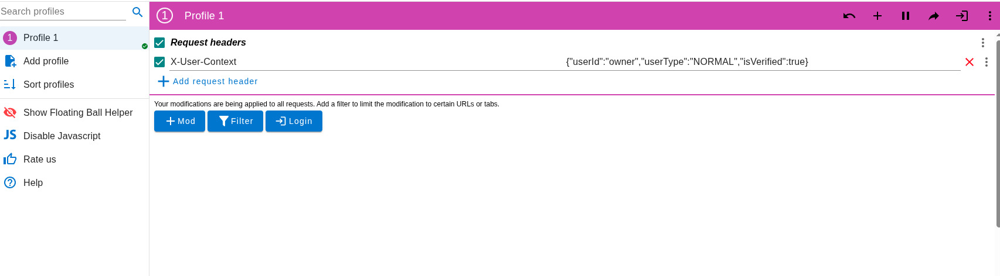

# integration-doc
Follow the following instruction to perform system testing
1. Create a root folder to hold all project source codes (let's say it's `project`). You can also use VSCode's workspace to work on multiple projects together.
   
   
   
2. Frontend setup
   1. Inside the `project` folder, run `git clone https://github.com/pgwpwei/forum-frontend` to download the frontend code.
   2. Run `npm install` and `npm run dev -- --port 3000` to launch the development server on port `3000`.
   3. (Test): go to `http://localhost:3000` and you should see a "Loading authentication" page.
3. Gateway setup
   1.  Run `git clone https://github.com/ChenNingCong/forum-gateway` to download the gateway codes (Joe is not here today so I will use my own version of gateway).
   2.  Create a `.env` file in the root directory with the following line (this is for JWT token). Any token works.:
   `ACCESS_TOKEN_SECRET=8efaf6d52fa6d6674e6f9f27d72e0a76285a7be1b93772d7e90f5639c28449c58686f37203f45a629ca4b22d3af7751848ed34cab37297d6f159ee99b835c9de`
   3.  Run `npm install` and `npm start server.js`.
   4.  (Test): go to `http://localhost:8080/api/health` and you should see a "OK" message.
   5.  (Test): If you launch both the frontend and the gateway, go to `http://localhost:3000` you should see the login page.
4. Your microservice setup
   1. The ports are defined in `port.md` file in this repo. Please update your backend to use the specific port. Note the port starts from `8000`, not `8080`.
   2. You should only use the specific route defined in `port.md`. For example, only use `/api/users`, but not `/api/user`.
   3. (Test): access your api by using the route.
5. How to setup authorization and authentication for your API?
Currently the gateway is not integrated with auth/user service yet. 
To test the API without relying on the login service, you can use this chrome plugin called [`Mod`](https://modheader.com/).
Then you create a header called `X-User-Context` with the following value:

   **`X-User-Context`**: A JSON string with double-quoted property names
   ```json
     {"userId":"owner","userType":"NORMAL","isVerified":true}
   ```
     - `userId`: string value
     - `userType`: either `NORMAL` or `ADMIN`
     - `isVerified`: boolean value
    
    Here is a screenshot:
    
6.